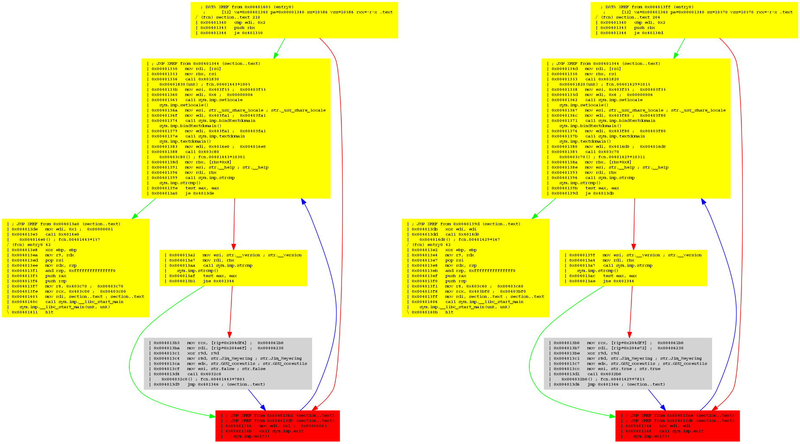

# Binary Diffing 

Based on radare.today article "[binary diffing](http://radare.today/binary-diffing/)"

Without parameter, `radiff2` will by default show what bytes changed, and the corresponding offsets.

    $ radiff2 genuine cracked
    0x000081e0 85c00f94c0 => 9090909090 0x000081e0  
    0x0007c805 85c00f84c0 => 9090909090 0x0007c805

    $ rasm2 -d 85c00f94c0
    test eax, eax  
    sete al
    
Notice how the two jumps are noped.

For bulk processing, you may want to have a higher-overview of the differences. This is why radare2 is able to compute the distance and the percentage of similarity between two files with the `-s` option:

    $ radiff2 -s /bin/true /bin/false
    similarity: 0.97  
    distance: 743  
    
    
If you want more concrete data, it's also possible to count the differences, with the `-c` option:

    $ radiff2 -c genuine cracked
    2  
    
    
If you're unsure about the fact that you're dealing with similar binaries, you can check if some functions are matching with the `-C` option. The columns being: "First file offset", "Percentage of matching" and "Second file offset".

    $ radiff2 -C /bin/false /bin/true 
             entry0  0x4013e8 |   MATCH  (0.904762) | 0x4013e2  entry0
             sym.imp.__libc_start_main  0x401190 |   MATCH  (1.000000) | 0x401190  sym.imp.__libc_start_main  
             fcn.00401196  0x401196 |   MATCH  (1.000000) | 0x401196  fcn.00401196
             fcn.0040103c  0x40103c |   MATCH  (1.000000) | 0x40103c  fcn.0040103c
             fcn.00401046  0x401046 |   MATCH  (1.000000) | 0x401046  fcn.00401046
             [...]

And now the cool feature : radare2 supports graph-diffing, à la [DarunGrim](http://www.darungrim.org/), with the `-g` option. You can either give a symbol name, of specify two offsets in case the function you want to diff doesn't have the same name in both file.

For example, `radiff2 -g main /bin/true /bin/false | xdot -` will show the differences between the main function of true and false. You can compare it to `radiff2 -g main /bin/false /bin/true` (Notice the order of the arguments) to get the two versions.

This is the result: 

