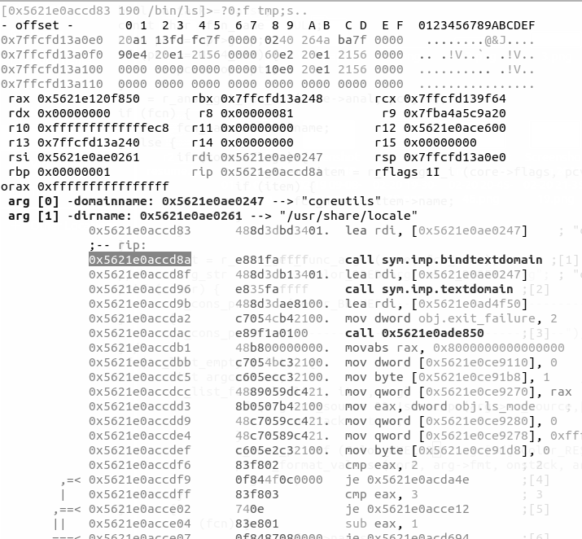
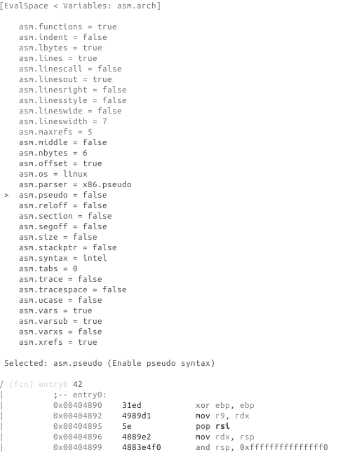
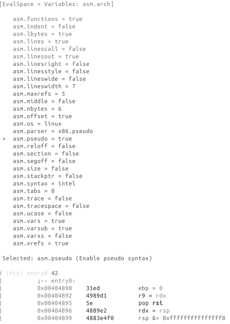

# Visual Disassembly

## Navigation

Move within the Disassembly using `arrows` or `hjkl`. Use `o` to seek directly to a flag or an offset, type it when requested by the prompt: `[offset]>`.
Follow a jump or a call using the `number` of your keyboard `[0-9]` and the number on the right in disassembly to follow a call or a jump. In this example typing `1` on the keyboard would follow the call to `sym.imp.__libc_start_main` and therefore, seek at the offset of this symbol.

```
            0x00404894      e857dcffff     call sym.imp.__libc_start_main ;[1]
```

Seek back to the previous location using `u`, `U` will allow you to redo the seek.

## `d` as define

`d` can be used to change the type of data of the current block, several basic types/structures are available as well as more advanced one using `pf` template:

```
d → ...
0x004048f7      48c1e83f       shr rax, 0x3f
d → b
0x004048f7 .byte 0x48
d → B
0x004048f7 .word 0xc148
d → d
0x004048f7 hex length=165 delta=0
0x004048f7  48c1 e83f 4801 c648 d1fe 7415 b800 0000  H..?H..H..t.....
...
```

To improve code readability you can change how radare2 presents numerical values in disassembly, by default most of disassembly display numerical value as hexadecimal. Sometimes you would like to view it as a decimal, binary or even custom defined constant. To change value format you can use `d` following by `i` then choose what base to work in, this is the equivalent to `ahi`:

```
d → i → ...
0x004048f7      48c1e83f       shr rax, 0x3f
d → i →  10
0x004048f7      48c1e83f       shr rax, 63
d → i →  2
0x004048f7      48c1e83f       shr rax, '?'
```

### Usage of the Cursor for Inserting/Patching...

Remember that, to be able to actually edit files loaded in radare2, you have to start it with the `-w` option. Otherwise a file is opened in read-only mode.

Pressing lowercase `c` toggles the cursor mode. When this mode is active, the currently selected byte (or byte range) is highlighted.


The cursor is used to select a range of bytes or simply to point to a byte. You can use the cursor to create a named flag at specifc location. To do so, seek to the required position, then press `f` and enter a name for a flag.
If the file was opened in write mode using the `-w` flag or the `o+` command, you can also use the cursor to overwrite a selected range with new values. To do so, select a range of bytes (with HJKL and SHIFT key pressed), then press `i` and enter the hexpair values for the new data. The data will be repeated as needed to fill the range selected. For example:
```
<select 10 bytes in visual mode using SHIFT+HJKL>
<press 'i' and then enter '12 34'>
```
The 10 bytes you have selected will be changed to "12 34 12 34 12 ...".


The Visual Assembler is a feature that provides a live-preview while you type in new instructions to patch
into the disassembly. To use it, seek or place the cursor at the wanted location and hit the 'A' key. To provide multiple instructions, seperate them with semicolons, `;`.

## XREF

When radare2 has discovered a XREF during the analysis, it will show you the information in the Visual Disassembly using `XREF` tag:

```
            ; DATA XREF from 0x00402e0e (unk)
            str.David_MacKenzie:
```

To see where this string is called, press `x`, if you want to jump to the location where the data is used then press the corresponding number [0-9] on your keyboard. (This functionality is similar to `axt`)

`X` corresponds to the reverse operation aka `axf`.

## Function Argument display

To enable this vew use this config var `e dbg.funcarg = true`



## Add a comment

To add a comment press `;`.

## Type other commands

Quickly type commands using `:`.

## Search

`/`: allows highlighting of strings in the current display.
`:cmd` allows you to use one of the "/?" commands that perform more specialized searches.

## The HUDS

### The "UserFriendly HUD"

The "UserFriendly HUD" can be accessed using the `??` key-combination. This HUD acts as an interactive Cheat Sheet that one can use to more easily find and execute commands. This HUD is particularly useful for new-comers. For experienced users, the other HUDS which are more activity-specific may be more useful.

### The "flag/comment/functions/.. HUD"

This HUD can be displayed using the `_` key, it shows a list of all the flags defined and lets you jump to them. Using the keyboard you can quickly filter the list down to a flag that contains a specific pattern.

## Tweaking the Disassembly

The disassembly's look-and-feel is controlled using the "asm.* configuration keys, which can be
changed using the `e` command. All configuration keys can also be edited through the Visual Configuration Editor.

## Visual Configuration Editor

This HUD can be accessed using the `e` key in visual mode. The editor allows you to easily examine and change radare2's configuration. For example, if you want to change something about the disassembly display, select `asm` from the list, navigate to the item you wish to modify it, then select it by hitting `Enter`.
If the item is a boolean variable, it will toggle, otherwise you will be prompted to provide a new value.


Example switch to pseudo disassembly:






Following are some example of eval variable related to disassembly.

## Examples

#### asm.arch: Change Architecture && asm.bits: Word size in bits at assembler

You can view the list of all arch using `e asm.arch=?`

```
e asm.arch = dalvik
            0x00404870      31ed4989       cmp-long v237, v73, v137
            0x00404874      d15e4889       rsub-int v14, v5, 0x8948
            0x00404878      e24883e4       ushr-int/lit8 v72, v131, 0xe4
            0x0040487c      f0505449c7c0   +invoke-object-init-range {}, method+18772 ;[0]
            0x00404882      90244100       add-int v36, v65, v0
```

```
e asm.bits = 16
            0000:4870      31ed           xor bp, bp
            0000:4872      49             dec cx
            0000:4873      89d1           mov cx, dx
            0000:4875      5e             pop si
            0000:4876      48             dec ax
            0000:4877      89e2           mov dx, sp
```
This latest operation can also be done using `&` in Visual mode.


#### asm.pseudo: Enable pseudo syntax

```
e asm.pseudo = true
            0x00404870      31ed           ebp = 0
            0x00404872      4989d1         r9 = rdx
            0x00404875      5e             pop rsi
            0x00404876      4889e2         rdx = rsp
            0x00404879      4883e4f0       rsp &= 0xfffffffffffffff0
```

#### asm.syntax: Select assembly syntax (intel, att, masm...)

```
e asm.syntax = att
            0x00404870      31ed           xor %ebp, %ebp
            0x00404872      4989d1         mov %rdx, %r9
            0x00404875      5e             pop %rsi
            0x00404876      4889e2         mov %rsp, %rdx
            0x00404879      4883e4f0       and $0xfffffffffffffff0, %rsp
```

#### asm.describe: Show opcode description

```
e asm.describe = true
            0x00404870      31ed           xor ebp, ebp                ; logical exclusive or
            0x00404872      4989d1         mov r9, rdx                 ; moves data from src to dst
            0x00404875      5e             pop rsi                     ; pops last element of stack and stores the result in argument
            0x00404876      4889e2         mov rdx, rsp                ; moves data from src to dst
            0x00404879      4883e4f0       and rsp, 0xfffffffffffffff0 ; binary and operation between src and dst, stores result on dst
```


