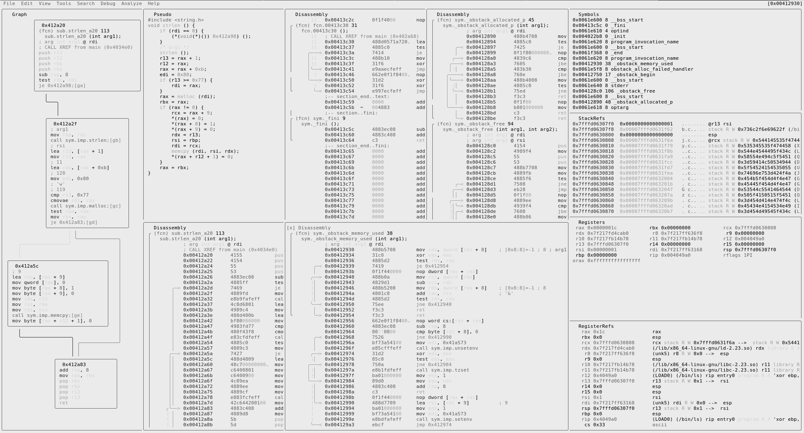

# Visual Panels

## Concept

Do you like vim? Don't even answer that, I know you do.

Or do you ever feel like splitting the disassembly screen so that you can read the different offset while you keep the one you are reading now?

Visual Panels would meet the demands by providing the following features.

1. Split Screen
2. Display the multiple screens such as Symbols, Registers, Stack, and you can even define your own panel too.
3. Menu will cover all those commonly used commands for you so that you don't have to memorize any of them.

Briefly, it is all about vim-like CUI combined with some useful GUI.

## Overview



## Commands
```
| Panels commands:
| !                       run r2048 game
| :                       run r2 command in prompt
| _                       start the hud input mode
| |                       split the current panel vertically
| -                       split the current panel horizontally
| w                       change the current layout of the panels
| ?                       show this help
| X                       close current panel
| m                       move to the menu
| V                       go to the graph mode
| b                       browse symbols, flags, configurations, classes, etc
| c                       toggle cursor
| C                       toggle color
| d                       define in the current address. Same as Vd
| e                       change title and command of current panel
| D                       show disassembly in the current panel
| g                       show graph in the current panel
| *                       show pseudo code/r2dec in the current panel\n
| i                       insert hex
| M                       open new custom frame
| hl                      scroll panels horizontally
| HL                      resize panels horizontally
| jk                      scroll panels vertically
| JK                      scroll panels vertically by page
| sS                      step in / step over
| uU                      undo / redo seek
| pP                      seek to next or previous scr.nkey
| nN                      create new panel with given command
| q                       quit, back to visual mode
```

## Basic workaround

Use `tab` to move around the panels until you get to the targeted panel then use `hjkl`, just like vim, to scroll the current panel you are on.
`S` and `s` to step over/in, and all the panels should be updated dynamically while you are debugging.
Either in the Registers or Stack panel, you can even edit the values by inserting hex. This will be explained later.
The mode also has got the menu thing. Even though you can get there eventually by hitting `tab` several times, it is highly recommended just to push `m`.
As usual, you can use `hjkl` to move around the menu and will find tons of useful stuff there.

## Split screen

`|` is for the vertical and `-` is for the horizontal. You can delete any panel by `X`.

## Edit values

Either in the Register or Stack panel, you can edit the values.
`c` to activate cursor mode and you can manipulate the cursor by `hjkl` per usual. Then, hit `i`, just like the insert mode of vim, to insert the value.
